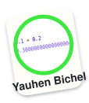

# py-harness

[](./LICENSE)
[](https://pypi.org/project/py-harness-cli/)
[](https://github.com/YauhenBichel/py-harness/actions/workflows/ci.yml)
[](https://yauhenbichel.github.io/py-harness/)
[](https://yauhenbichel.github.io/py-harness/)
[](https://github.com/YauhenBichel/py-harness#contributors)

Four jobs on your laptop: **ask**, **write a test**, **fix a bug**, **add
one small function**. Only touches the folder you point at. Daily work
is `py-harness` plus Ollama `llama3.1:8b`. Not everyday-ready.
Site: [yauhenbichel.github.io/py-harness](https://yauhenbichel.github.io/py-harness/).

## Run it

```bash
python3 -m venv .venv && source .venv/bin/activate
pip install py-harness-cli
```

The command is `py-harness`. The PyPI name is `py-harness-cli` because
`py-harness` collides with another package. Do not `pip install
py-harness` or `pip install pyharness`.

Sample project — clone, then `cd demo/orders`. Do not `brief` this
repository.

```bash
git clone https://github.com/YauhenBichel/py-harness.git
cd py-harness/demo/orders
py-harness brief
py-harness ask  "what does compute_total return?"
py-harness run  "find the NameError and fix it"
```

Activate `.venv` in **every new terminal**. If the shell says
`command not found: py-harness`, it is not active. Daily work needs
`ollama pull llama3.1:8b`. From a clone,
`python3 scripts/run/install.py` is the editable install.

`ask` never writes. `run` writes, then runs the tests. The NameError
sample is built into the tool (no model). Another folder:
`py-harness ask ~/app "what does add return?"`.

[Start](https://yauhenbichel.github.io/py-harness/start/) ·
[Commands](https://yauhenbichel.github.io/py-harness/api/) ·
[Contributing](./CONTRIBUTING.md) ·
[Security](./SECURITY.md)

## What it looks like


Replay: `asciinema play docs/media/pip-demo.cast`.
A longer session (8B ask): `docs/media/live-demo.gif`.
Full log: [Live demo](https://yauhenbichel.github.io/py-harness/live/).

**VS Code** — `py-harness editors vscode`, then Tasks: Run Task.


Replay: `asciinema play docs/media/vscode-demo.cast`.
[VS Code](https://yauhenbichel.github.io/py-harness/vscode/).

**Cursor** — `py-harness editors cursor --allow-writes`, then chat or Tasks.


Replay: `asciinema play docs/media/cursor-demo.cast`.
[Cursor](https://yauhenbichel.github.io/py-harness/cursor/).

## Scores

One laptop. 29 Aug–5 Sep 2026. **Not everyday-ready.**

| What I tried | Result |
| --- | --- |
| 0.5B as daily work | **0 / 4** vibe, **0 / 2** parse |
| Four Start commands on `demo/orders` | **0 / 4**, then **4 / 4** after the harness |
| Same bench, code must run | 8B **6–9 / 9**; 7B coder 7 / 9; 30B timeout |
| Same-night daily (write tests, clamp, sum × 3) | 8B **9 / 9**, 7B coder **7 / 9**. Keep the 8B |
| Extra 7B–8B on disk | 8192-warmed SWE daily clamp: first generate 180s. Not a score |
| A real repository (4,580 files) | reading works; writing **1 / 12** |

The long table: [Experiments](https://yauhenbichel.github.io/py-harness/investigations/experiments/).
Every score: [Results](https://yauhenbichel.github.io/py-harness/investigations/).
Which tags timed out: [Hub models](https://yauhenbichel.github.io/py-harness/investigations/hub-models/).

## Experiments

Every run since 24 September goes through `scripts/measure/experiment.py`,
which files a record under `docs/experiments/` with its commit, model and
every raw row, and refuses to call a gap inside the noise floor a result.
"Worked" is read off the project afterwards by running the code; "hit the
step limit" is a run that landed something and never managed to say done.

| date | experiment | model | tiers | passes | worked | hit the step limit | mean steps | note |
| --- | --- | --- | --- | --- | --- | --- | --- | --- |
| 2026-09-24 | `baseline-t1-qwen3coder30b` | qwen3-coder:30b | 1 | 3 | **9 / 9** | 0 | 4.0 | smoke: tier 1 on the 30B |
| 2026-09-24 | `tier6-qwen3coder30b` | qwen3-coder:30b | 6 | 5 | **20 / 20** | 2 | 5.0 | the tier that was a wall for the 8B, on the 30B |
| 2026-09-24 | `tier6-qwen35-9b` | factory-qwen3.5-9b:q4_K_M | 6 | 5 | **16 / 20** | 0 | 3.6 | same tier, a 9B; 2 runs errored (host) |
| 2026-09-24 | `all-tiers-qwen3coder30b` | qwen3-coder:30b | 1,2,3,4,5,6 | 5 | **72 / 75** | 12 | 4.2 | tiers 1–6 on the 30B; 3 runs errored (host) |
| 2026-09-27 | `decide-regex` | qwen3-coder:30b | 5,7 | 5 | **30 / 30** | 9 | 4.4 | regex decider, 30B, tiers 5+7 |
| 2026-09-27 | `decide-model` | qwen3-coder:30b | 5,7 | 5 | **30 / 30** | 16 | 6.0 | decision model, 30B: same score, 16 runs never said done |
| 2026-09-27 | `bugfix-closes-regex` | qwen3-coder:30b | 5,7 | 5 | **30 / 30** | 3 | 3.2 | after fix 1 (bug fix closes on a green suite) |
| 2026-09-27 | `bugfix-closes-model` | qwen3-coder:30b | 5,7 | 5 | **30 / 30** | 3 | 2.2 | after fix 1, decision model |
| 2026-09-27 | `bugfix-done-regex` | qwen3-coder:30b | 5,7 | 5 | **30 / 30** | 0 | 1.9 | after fix 2 (done taken when asked, even in prose) |
| 2026-09-27 | `bugfix-done-model` | qwen3-coder:30b | 5,7 | 5 | **30 / 30** | 0 | 1.4 | after fix 2, decision model |
| 2026-09-27 | `decide-regex-7b` | qwen2.5-coder:7b | 5,7 | 5 | **6 / 30** | 24 | 8.3 | regex decider on a 7B |
| 2026-09-27 | `decide-model-7b` | qwen2.5-coder:7b | 5,7 | 5 | **11 / 30** | 18 | 6.5 | decision model on a 7B: REAL +5, all from one repair |
| 2026-09-27 | `diff-json-7b` | qwen2.5-coder:7b | 5,7 | 5 | **15 / 30** | 15 | 5.6 | 7B, parser reads diffs and JSON turns: REAL +4 |
| 2026-09-27 | `bare-diff-7b` | qwen2.5-coder:7b | 5,7 | 5 | **15 / 30** | 14 | 5.2 | 7B, parser reads a bare diff too: NOISE, floor 3 |

**The decision model against the regexes.** `bge-m3` embeddings and one
logistic regression per intent, fitted on 841 generated phrasings
([the dataset](https://huggingface.co/datasets/YauhenBichel/py-harness-intents)).

| is it a bug fix? | decision model | regex | prompted 1.5B |
| --- | --- | --- | --- |
| 203 held-out generated phrasings, 12 intents | **90%** multi-class; bugfix F1 **0.91** | bugfix F1 0.10 | — |
| 55 hand-written phrasings | **86%**, 0 false positives | 53%, 3 | 63%, 5 |
| 19 hand-labelled probe cases, 3 repeats | **17 / 19** | 11 / 19 | 12 / 19 |
| benchmark cases the two deciders route apart | tiers 1–6: **0 of 15**; tier 7: **4 of 4** | | |

**What the runs say.** On the 30B the decider cannot move a pass count
that is already 30 / 30; it exposed three harness faults on the bug-fix
path instead (runs that never said done: 16 → 3 → 0). On the 7B it is
REAL, +5 of 30, all of it one case the harness then repairs without the
model. Reading the 7B's replies as it writes them — diffs and JSON — is
another REAL +4. After that the 7B's own pass-to-pass spread is three
cases, so five passes cannot see a smaller gain.

**Not measured.** `llama3.1:8b` on the GPU host (Ollama 0.34.0, ROCm) is
coherent under about 500 prompt tokens and word salad above, so no number
from it means anything until that is understood; the 7B stands in.

The records: [`docs/experiments/`](docs/experiments/) and the same files on
[Hugging Face](https://huggingface.co/datasets/YauhenBichel/py-harness-intents/tree/main/experiments).
The write-ups: [What would make it useful](https://yauhenbichel.github.io/py-harness/investigations/what-would-make-it-useful/)
and the [Experiments](https://yauhenbichel.github.io/py-harness/investigations/experiments/) appendix.

## More

| If you want | Go here |
| --- | --- |
| What each folder is | [Folders](https://yauhenbichel.github.io/py-harness/tree/) |
| Tests | `PYTHONPATH=src python -m unittest discover -s tests -q` |
| 0.5B style prior | [YauhenBichel/python-vibe-0.5b](https://huggingface.co/YauhenBichel/python-vibe-0.5b) |
| Train / serve / API | [Commands](https://yauhenbichel.github.io/py-harness/api/) |
| A first issue | [good first issue](https://github.com/YauhenBichel/py-harness/labels/good%20first%20issue) |

Vulnerabilities: a **public** GitHub issue. Do not paste live keys.

---

## Contributors

Thank you to everyone who has helped py-harness.

<!-- readme: contributors,bots/- -start -->
<p align="center">
  <a href="https://github.com/YauhenBichel" title="Yauhen Bichel" aria-label="Yauhen Bichel"></a>
  <a href="https://github.com/xianjianlf2" title="Mark Xian" aria-label="Mark Xian"></a>
  <a href="https://github.com/ItzSaurav" title="Itzsaurav" aria-label="Itzsaurav"></a>
  <a href="https://github.com/svkzn" title="svkzn" aria-label="svkzn"></a>
  <a href="https://github.com/Aditya-233" title="Aditya" aria-label="Aditya"></a>
  <a href="https://github.com/kkkhs" title="Huangshuo Kuang" aria-label="Huangshuo Kuang"></a>
  <a href="https://github.com/be-student" title="송은우" aria-label="송은우"></a>
</p>
<!-- readme: contributors,bots/- -end -->

Filled from GitHub commits (bots omitted). [Contributor graph](https://github.com/YauhenBichel/py-harness/graphs/contributors) · [good first issue](https://github.com/YauhenBichel/py-harness/labels/good%20first%20issue) · [Action](https://github.com/YauhenBichel/readme-contributors)
